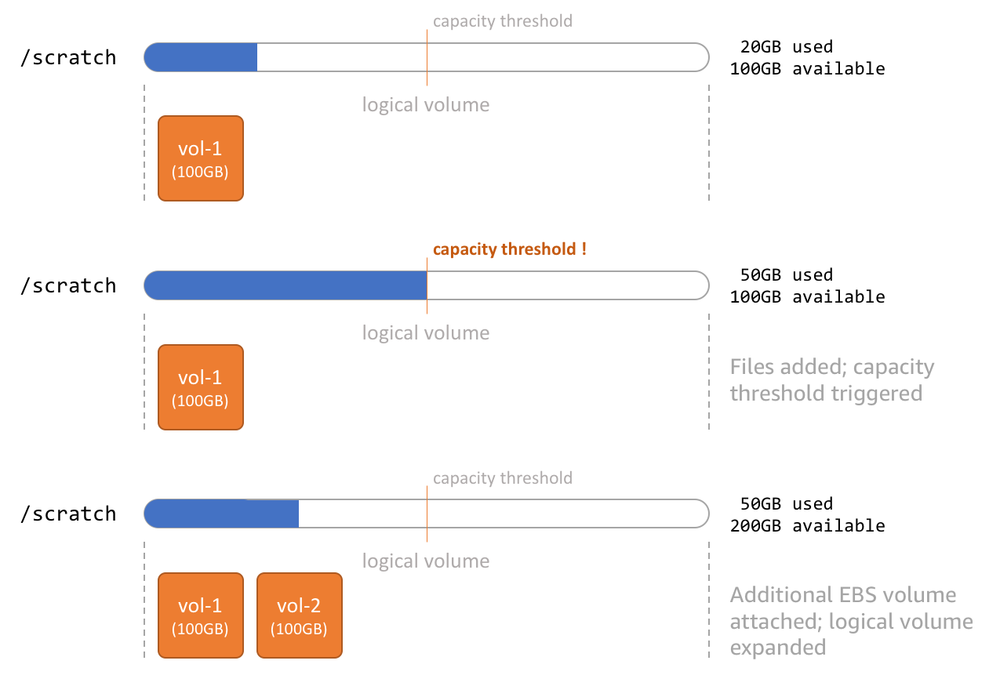

# Creating Custom Compute Resources

Genomics is a data-heavy workload and requires some modification to the defaults used for batch job processing. In particular, instances running the Tasks/Jobs need scalable storage to meet unpredictable runtime demands.

By default, AWS Batch relies upon the [Amazon ECS-Optimized AMI](https://docs.aws.amazon.com/AmazonECS/latest/developerguide/ecs-optimized_AMI.html)
to launch container instances for running jobs.  This is sufficient in most cases, but specialized needs, such as the large storage requirements noted above, require customization of the base AMI.

This section provides two methods for customizing the base ECS-Optimized AMI that adds an expandable working directory for jobs to write data.
A process will monitor the directory and add more EBS volumes on the fly to expand the free space based on the capacity threshold, like so:

