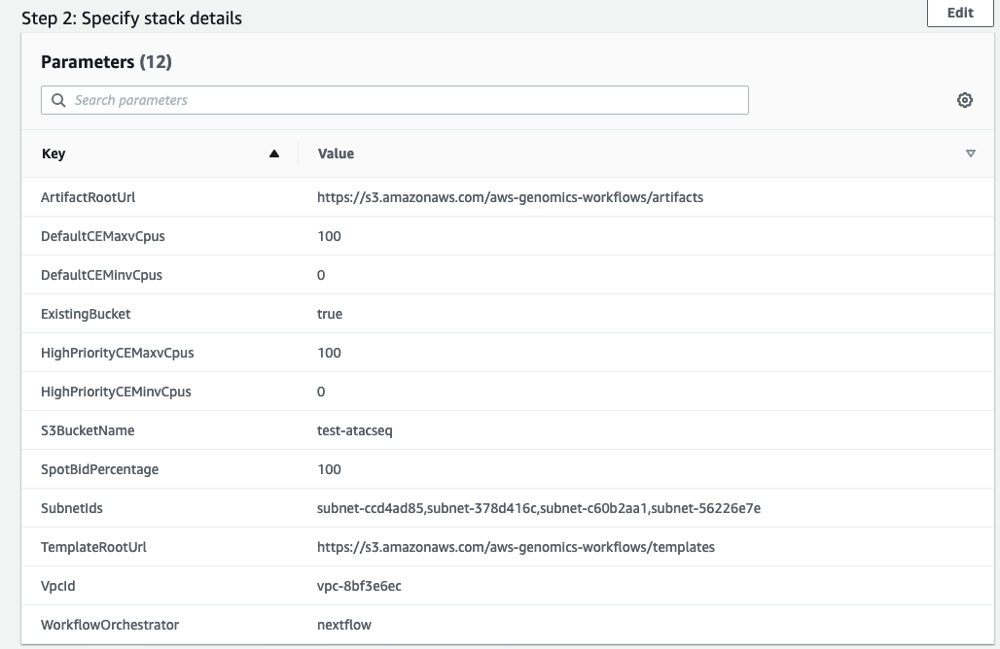
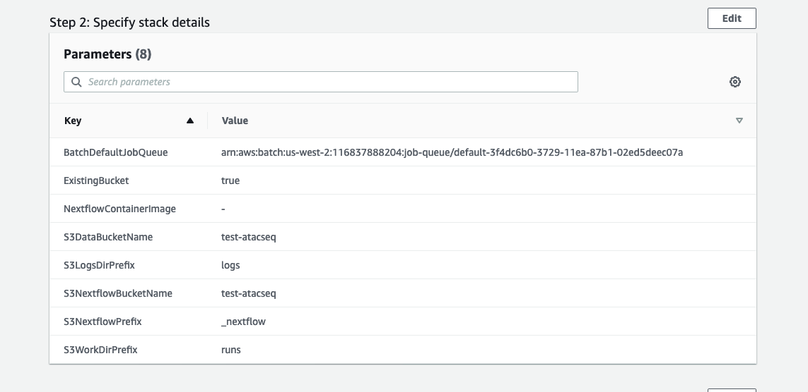
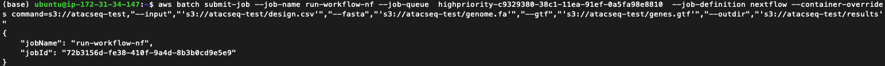
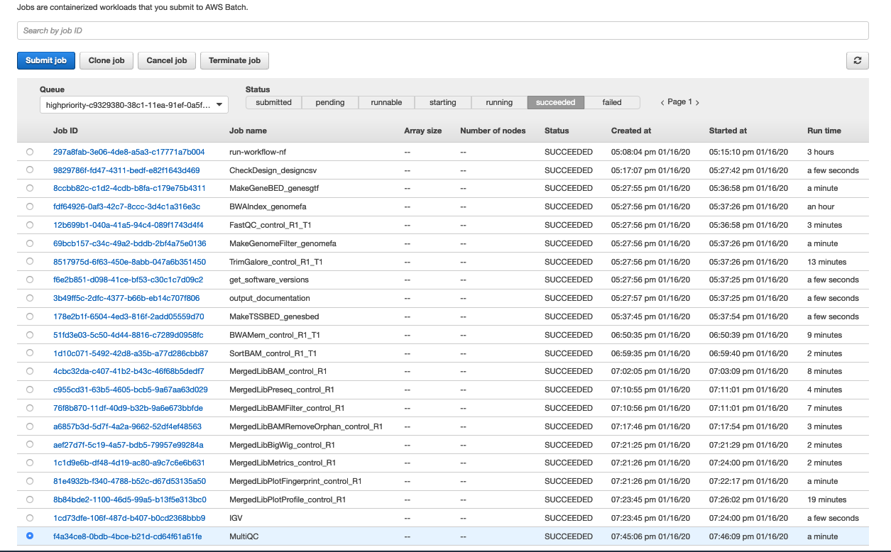
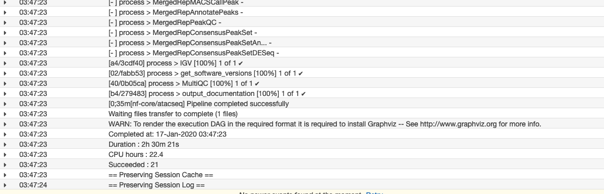

# ATACseq pipeline

Launch cloud infrastructure - http://www.docs.diabetesepigenome.org.s3-website-us-west-2.amazonaws.com/genomics-workflow/cloudformation-templates/

- Launch "Full Stack" CloudFormation template that will create EC2 Launch Templates, AWS Batch Job Queues and Compute Environments, a secure Amazon S3 bucket, and IAM policies and roles within an existing VPC. NOTE: You must provide VPC ID, and subnet IDs.
Parameters used



Once the full stack is successfully completed, click on the Outputs tab and copy down the AWS Batch Job Queue ARN for the default and high-priority queues. You will need these when configuring your workflow orchestration system (Nextflow) to use AWS Batch as a backend for task distribution

Launch  Workflow Orchestrator - Nextflow; that create Nextflow specific resources needed to run on AWS: an S3 Bucket for nextflow config and workflows, AWS Batch Job Definition for a Nextflow head node, and an IAM role for the nextflow head node job
Parameters


To run a workflow you submit a `nextflow` Batch job to the appropriate Batch Job Queue via the command line with the AWS CLI

```
git clone https://github.com/nf-core/atacseq.git
aws s3 sync atacseq s3://path/to/workflow/folder


aws batch submit-job --job-name run-workflow-nf --job-queue <queue-name>  --job-definition nextflow --container-overrides command=s3://path/to/workflow/folder,"--input","'s3://path/to/workflow/folder/design.csv'","--fasta","'s3://path/to/workflow/folder/genome.fa'","--gtf","'s3://path/to/workflow/folder/genes.gtf'","--outdir","'s3://path/to/workflow/folder/results'"
```




Nextflow ATACSeq Pipeline summary

    1. Raw read QC (FastQC)
    2. Adapter trimming (Trim Galore!)
    3. Alignment (BWA)
    4. Mark duplicates (picard)
    5. Merge alignments from multiple libraries of the same sample (picard)
        i. Re-mark duplicates (picard)
        ii. Filtering to remove:
            - reads mapping to mitochondrial DNA (SAMtools)
            - reads mapping to blacklisted regions (SAMtools, BEDTools)
            - reads that are marked as duplicates (SAMtools)
            - reads that arent marked as primary alignments (SAMtools)
            - reads that are unmapped (SAMtools)
            - reads that map to multiple locations (SAMtools)
            - reads containing > 4 mismatches (BAMTools)
            - reads that are soft-clipped (BAMTools)
            - reads that have an insert size > 2kb (BAMTools; paired-end only)
            - reads that map to different chromosomes (Pysam; paired-end only)
            - reads that arent in FR orientation (Pysam; paired-end only)
            - reads where only one read of the pair fails the above criteria (Pysam; paired-end only)
        iii. Alignment-level QC and estimation of library complexity (picard, Preseq)
        iv. Create normalised bigWig files scaled to 1 million mapped reads (BEDTools, wigToBigWig)
        v. Generate gene-body meta-profile from bigWig files (deepTools)
        vi. Calculate genome-wide enrichment (deepTools)
        vii. Call broad/narrow peaks (MACS2)
        viii. Annotate peaks relative to gene features (HOMER)
        ix. Create consensus peakset across all samples and create tabular file to aid in the filtering of the data (BEDTools)
        x. Count reads in consensus peaks (featureCounts)
        xi. Differential accessibility analysis, PCA and clustering (R, DESeq2)
        xii. Generate ATAC-seq specific QC html report (ataqv)
    6. Merge filtered alignments across replicates (picard)
        i. Re-mark duplicates (picard)
        ii. Remove duplicate reads (SAMtools)
        iii. Create normalised bigWig files scaled to 1 million mapped reads (BEDTools, wigToBigWig)
        iv. Call broad/narrow peaks (MACS2)
        v. Annotate peaks relative to gene features (HOMER)
        vi. Create consensus peakset across all samples and create tabular file to aid in the filtering of the data (BEDTools)
        vii. Count reads in consensus peaks relative to merged library-level alignments (featureCounts)
        viii. Differential accessibility analysis, PCA and clustering (R, DESeq2)
    7. Create IGV session file containing bigWig tracks, peaks and differential sites for data visualisation (IGV).
    8. Present QC for raw read, alignment, peak-calling and differential accessibility results (ataqv, MultiQC, R)

For all of the available options when running the pipeline - https://github.com/nf-core/atacseq/blob/master/docs/usage.md

Monitoring jobs

- You can monitor jobs via was batch service
- Monitor logs via. CloudWatch 



